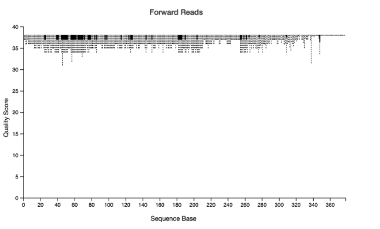

# MICB475_Team11

## Agenda and Meeting Minutes 
### January 
[Jan 28](./Meeting%20Minutes/Jan%2028.md) 

### February 
[Feb 4](./Meeting%20Minutes/Feb%204.md) | [Feb 11](./Meeting%20Minutes/Feb%2011.md) | [Feb 25](./Meeting%20Minutes/Feb%2025.md) 

### March 
[Mar 4](./Meeting%20Minutes/Mar%204.md) | [Mar 11](./Meeting%20Minutes/Feb%2011.md) | [Mar 18](./Meeting%20Minutes/Feb%2018.md) | [Mar 25](./Meeting%20Minutes/Feb%2025.md) 

## Lab Notebook 
### Data Processing 
- [P01](./Notebook/P01.Rmd) - QIIME 2 Demultiplexing
- P02 - QIIME 2 Denoising and Clustering
- P03 - QIIME 2 Taxonomic Analysis
- P04 - QIIME 2 Alpha-rarefaction
- P05 - QIIME 2 Diversity Analysis

### Data Analysis  
- P06 - Aim 1: Investigating the Microbiome Composition in Intestinal vs Diffuse Gastric Cancer and Evaluating the Influence of Biological Sex
- P07 - Aim 2: Identify the Specific Bacteria that Best Distinguish Intestinal vs Diffuse Cancers
- P08 - Aim 3: Functional Analysis and Profiling of Microbial Communities Within Subtypes

## Final Script 
### QIIME 2
- Data Processing  

### R
- Aim 1:
- Aim 2:
- Aim 3: 

# Meeting Minutes - January 28, 2026 
### Introduction to Weekly Team Meetings 
- We will lead discussion using your agenda
- Take notes, discussion points, action items etc to put on github 
- PART OF COURSE EVAL

### Before every meeting 
- Write down anything from meeting
- Questions
- Concerns abt script
- Can ask about analyzing results 
Complete tasks by night before meeting!!
- Upload finished analysis 
- Can always email for help outside meetings 

### Github 
- consult Module 18 
- One public github repo
- MICB475_Team11
- Organize by type of analysis 
Each folder - have subdirectories 
Figures, codes, etc

### README File  
- Hve bullet point discussed during meeting
- And what want to talk abt after meeting 
- PART OF COURSE EVAL 
- Organized and help writing 
- HAVE THIS SET UP BEFORE NEXT MEETING (Agenda and what to do)
- @ bessie and evelyn 

### Course timeline
- Pick one or two datasets next week- At end of next week - commit to 1 or 2 dataset 
- And preliminary questions want to ask 
Week 4 - brainstorm potential topics 
Week 6 - proposal due

# Pitches 
## Gastric cancer: Lauren histological subtypes and the microbiome

Gap / novelty
- Wang et al. grouped all gastric cancers together and did not stratify by Lauren classification
- Metadata includes intestinal, diffuse, and mixed subtypes
- Very few studies compare gastric microbiomes across these subtypes
- Wang et al. observed lower H. pylori in intestinal-type tumors vs diffuse-type but did not analyze overall community differences
  
Key background (Lauren classification)
- Intestinal type: gland-forming, inflammation-driven, strongly linked to H. pylori, more localized
- Diffuse type: poorly organized cells, infiltrative growth, weaker H. pylori link, more genetically driven (e.g. CDH1)

Core distinction:
– Intestinal = structured, chronic inflammation pathway
– Diffuse = disorganized, infiltrative pathway

Research question
- Do gastric microbiome diversity and taxonomic composition differ between intestinal and diffuse gastric cancer subtypes?

** Focus on Lauren's classification 

## Gastric cancer: tumor location (cardia vs non-cardia) and the microbiome

Gap / novelty
- Wang et al. did not analyze microbiome differences by tumor location
-Metadata labels tumors as cardia vs non-cardia
- Cardia and non-cardia cancers are epidemiologically distinct but rarely compared microbiome-wise
- Limited prior work suggests higher Helicobacter abundance in cardia cancers, but evidence is sparse
  
Key background (tumor location)
- Cardia: upper stomach near esophagus, linked to reflux and obesity, weaker H. pylori association, greater oral/esophageal influence
- Non-cardia: body/antrum, strong H. pylori and chronic gastritis association, classic gastric cancer pathway
  
Research question
- Does tumor location (cardia vs non-cardia) associate with distinct gastric mucosal microbiome community structure and taxa?

** Focus on tumor location

## Multiple sclerosis: NSAID use as a microbiome confounder

Gap / novelty
- Many MS patients use NSAIDs for pain
- NSAIDs are known to alter gut microbiota
- The original study did not control for common non-MS medications
  
Rationale
- NSAIDs have been linked to shifts in Acidaminococcaceae, Bacteroides, and Enterobacteriaceae
- Could explain part of the MS-associated dysbiosis
  
Research question
- Is NSAID (Non-steroidal anti-inflammatory drug) use associated with distinct gut microbiome composition in MS patients, and does it contribute to observed differences vs healthy controls?

## Alcohol Consumption

Background 
- Drinking alcohol is associated with variation in human oral microbiome (Fan et al., 2018)
- Smoking alters oral microbiome diversity and composition
    - lower alpha diversity (Yu et al., 2017)

 Gap 
 - Thomas et al. (2014) investigated how alcohol and tobacco consumption affects bacterial richness in oral cavity mucosa biofilms
 - small sample size of 22 subjects
 - investigated 7 chronic and heavy users of both substances and 6 active smokers (rest were controls)
 - found a signifcant decrease in species richness in only smokers and smokers and drinkers compared to control
 - could not find a paper investigating drinkers and how smoking could have an affect
 - few studies investigated whether smoking modifies or changes the strength of associations between alcohol intake and oral microbiome 

Research question
- Does smoking status modify the association between alcohol consumption and oral microbiome diversity and composition? (ie is the effect of alcohol different in smokers vs non-smokers)

Research question
- Does alcohol consumption affect the oral microbiome differently in men versus women?
- 

## ART and microbiome

Possible Project Ideas (Andy)

10.1186/s40168-023-01718-4
HIV dataset

Does being on certain anti-retrovirals correlate with microbiome differences after controlling for BMI and antibiotics?
-	BMI
-	Antibiotics
-	Cohort_short
-	Current_art
Possible confounders: Arm_short, Age, Gender

## Gastric cancer and metabolic markers

https://doi.org/10.3389/fmicb.2020.00997
Gastric Cancer dataset

Do metabolic markers (like glucose, cholesterol triglycerides) explain microbiome variations independent of cancer stage?
-	Group
-	BMI
-	Blood Glucose
-	Total Cholesterol
-	Triglyceride
Possible confounders: Age, Gender, H. pylori test, Site

## Possible Neuro-Imbalances Within Different Disorders: 

Background / Novelty
- Most of the previous UJEMI papers focused on a single disease, but for this project, we will look at two different neurological conditions/disorders and compare the metabolic signatures found in them. 
- Instead of focusing on what makes up and categorizes each disorder, we will instead look at the shared 'neuro-inflammatory' metabolic signatures.
- We will use the "Depression" dataset as a baseline for mental health and see if those same markers appear in the Parkinsons dataset
- We will focus on certain "pro-inflammatory" metabolic signals that are common in both (eg: copper and potassium), which we hope will suggest that the microbiome doesn't just reflect a specific disease, but a general state of neurological stress.

Research Question
- Across patients diagnosed with either Parkinson’s Disease and Depression, are there conserved "neuro-inflammatory" metabolic signals or distinct differences across different neurological conditions?

## Infant Microbiome

This project uses an infant health and exposure metadata dataset to ask microbiology-focused questions about how early-life factors shape the gut microbiome. Although the dataset is primarily metadata (e.g., delivery mode, feeding type, antibiotic exposure, symptoms, and growth/appetite measures), each sample can be linked to microbiome sequencing outputs (e.g., 16S rRNA or shotgun profiles) using `#SampleID`. By combining metadata with microbial community data, we can test how specific exposures are associated with changes in microbial diversity, community composition, and the relative abundance of key taxa.

Key research directions include:
- **Early-life exposures -> microbiome:** Do delivery mode (C-section vs vaginal) and antibiotic exposure predict reduced microbial diversity or shifts in taxa such as *Bifidobacterium*?
- **Diet/feeding -> microbiome:** Does feeding type relate to the dominance of milk-adapted microbes and overall community structure?
- **Symptoms/illness -> microbiome signatures:** Are gastrointestinal symptoms (colic, diarrhea) associated with distinct microbiome profiles or dysbiosis-like patterns?
- **Allergy/immune outcomes -> microbiome:** Do infant or maternal allergy indicators correspond to differences in microbiome diversity or immunomodulatory taxa?
- **Growth/body composition -> microbes:** Is infant growth (e.g., weight-for-length z-scores) associated with microbiome “maturity,” diversity, or specific microbial patterns?
- **Family/shared environment:** Do related individuals (same household) have more similar microbiomes than unrelated individuals, suggesting microbial sharing?

Overall, the goal is to use real-world infant exposure and health variables to generate testable hypotheses about microbial ecology in early life and how microbiome development may relate to health outcomes.

## Infant Microbiome
Does early antibiotic exposure influence infant gut microbiome maturation and appetite-related behaviours, and do these effects differ between male and female infants?

# Agenda - February 4
- Present our chosen dataset 
- Propose potential research questions and areas of exploration

# Meeting Notes - Feb 4, 2026 

### Proposed Datasets and Feedback (Bolded)
<ins>Alcohol dataset:</ins>
- How smoking status affects alcohol consumption and the microbiome
**ALREADY DONE LAST TERM**

<ins>Alcohol affecting microbiome in males vs females</ins>
- 80 men vs 200 females
**Sample sizes are okay!**
- Alcohol consumption is annotated as a continuous variable (grams)
  - We would do different levels / amount of alcohol
**We could do male vs female for smoking and non-smoking**
  - More of a yes or no

**WE COULD COMBINE WITH THE VAPING DATASET!**

- **Small sample size = anything less than 3 (anything above this allows us to do statistical significance)**

<ins>Cardia vs Non-cardia (gastric cancer)</ins>
- Different parts of the stomach
**ALREADY DONE LAST TERM**

<ins>Infant dataset</ins>
- Different modes of delivery
**ALREADY BEEN DONE**
- Use of antibiotics
**SOMEONE TRIED, VERY FEW SAMPLES**
  - Interested in seeing if babies develop antibiotic-resistant genes
- Diet
**ALREADY BEEN DONE**
  - Weight change over the first week and microbiome
**COULD BE INTERESTING**
**CONTROL FOR BREAST-FED VS FORMULA**

<ins>HIV (therapy impact on microbiome)</ins>
- Do specific drugs have an impact on the microbiome
**ALREADY BEEN DONE**

<ins>OUR THREE SELECTED ONES:</ins>
- Alcohol difference in microbiome (male vs female in smoking vs non-smoking)
- Use of antibiotics in babies
- How differences in weight impact the microbiome

### General Feedback
- FUNCTIONAL ANALYSIS (for antibiotics and weight)
  - We have to learn ourselves
   - Everyone is doing it, so not that bad
  - Worried if we get enough statistical data analysis

- Binning might be an issue for the weight dataset
- They are Not sure of how binning would work
  - We could bin them by breast-fed vs formula
    - We DONT want to focus on feeding habits (compounding variable)
- We could graph time vs weight
  - Two lines (breast-fed vs formula)
- For alpha diversity (shannon)
  - We expect different profiles
- We don’t want to focus primarily on breast-fed vs formula (ALREADY BEEN DONE)
  - It’s tricky to bin, we could calculate how much each baby grew, and bin them by % change in weight.
- We can focus on the pre-existing bin of male vs female
- OR bin them on underweight, normal weight, overweight

-A lot of things to focus on (male vs female, breast-fed vs formula)
  - We can go forward with both in parallel 

- SUGGESTION: Look at first few weeks, then look at % change in weight over 12 months (lots of math)

### OUR FINAL SELECTED DATASET/RESEARCH QUESTION
<ins>EXPERIMENTAL AIMS/DESIGN</ins>
- Saman brought up the gastric vs intestinal cancer:
- They collected the lesions from the body and the antrum of the stomach
- We have four comparison groups (that are already defined)
  - Mixed
  - Diffused
  - Intestinal
  - Healthy

Diversity metrics (how many shared microbes vs distinct)
- Measure within each site
  - Then type
    - Look for effective sites (?)
- Core microbiome
- Indicator taxa (which species are highly associated with each group)
- DESeq (between shared, which are rich, depleted between certain conditions)
- Functional analysis  (which things are up vs downregulated)
  - Picrust2

**H. pylori defines where the cancer lesion is**

Keep in mind:
- Dr. Evelyn will send us the server credentials that we will use to run our work on
  - Its faster than working in our own individual containers
- We can start working on data processing 
  - We need this done before our proposal
  - If we hit a point about filtering/trimming
    - Email Bessie with the graph to make sure it's good
  - Make a habit of making a screen

<ins>FOR NEXT MEETING:</ins>
- Read over the proposal before the next meeting
- Find literature research on the different types
  - Literature on why we think the microbiome will drive different cancer subtypes?
  - Better understanding of tissue sites and whatnot for our project
- Take a good look at what we are controlling for (male vs female, etc.)

# Agenda - February 11
-  Discuss literature research on the different types/  why we think the microbiome will drive different cancer subtypes?
- Discuss our controls (male vs female, etc.)
- Discuss next steps for proposal

## Research question: How do gastric microbiome diversity and overall taxonomic composition differ between intestinal and diffuse gastric cancer subtypes?
- Healthy vs Cancer: Compare each subtype against healthy controls  to identify general tumor-associated shifts.
- Compare subtypes pairwise To test hypotheses of subtype-specific microbiomes.

## Meeting Notes — February 11

**Note:** Missed the first ~5 minutes of the meeting.

### Research Question (RQ)
How do **gastric microbiome diversity** and **overall taxonomic composition** differ between **intestinal** and **diffuse** gastric cancer subtypes?  
- Considering adding **sex** as a key factor.

### Working Hypothesis
We hypothesize that there will be **compositional and functional differences** between gastric cancer subtypes, and that these differences will be **affected by sex**.

### Proposed Analyses (Initial Plan)
- Run **PCoA** analyses **separately for males and females**.
- Focus on **beta diversity** comparisons.
- There are **3 sampling sites** available:
  - If one site appears very different, consider **merging the other two** sites (site handling to be decided after exploring clustering/differences).

### Background / Rationale Discussed
- Need to summarize **what research has been done** on microbiome differences between diffuse vs intestinal gastric cancers.
- Key points raised:
  - **Diffuse carcinomas** tend to be **less differentiated** and may have **lower microbial diversity**.
  - Another paper suggests **intestinal tumors** are associated with **different microbial groups**.
- Project novelty discussed:
  - Including **3 subtypes**: **diffuse**, **intestinal**, and **mixed**.
  - Team is leaning toward emphasizing **sex** and how it impacts the microbiome in relation to cancer.
  - Potential mechanism angle: **sex hormones (e.g., estrogen)** and links to gastric cancer.

### Proposal / Rubric Notes
- Avoid being **conclusive at the beginning** of the proposal.
- Provide clear **logic** for expected outcomes (explain *why* we think results may look a certain way).
- Explicitly describe **differences between diffuse**

# Agenda - February 25

## Restate research question:

- How do gastric microbiome diversity and taxonomic composition differ between intestinal and diffuse gastric cancer subtypes, and does biological sex modify these subtype-associated microbiome patterns?

Confirm final sample subset:

- GC only

- Intestinal vs Diffused type

- N = 45 (15 intestinal, 30 diffuse)

## QIIME2 Preprocessing

- Demultiplex summary + quality inspection

- DADA2 denoise-single (no truncation)

Generated:

- Feature table (ASVs)
- Denoising stats
- Assigned taxonomy using SILVA
- Removed mitochondria/chloroplast
-  Built a rooted phylogenetic tree

Filtered to:

- Group = Gastric cancer (GC)

- Histopathology = Intestinal type or Diffused type

## Dataset Summary
- ASVs after denoising: ~20,750
- Final subset size: 45 samples
- Rarefaction depth chosen: 10,222
- 43/45 samples retained after rarefaction

### 1. Forward Read Quality Profile

The forward-read quality plot was inspected before denoising.  
Quality scores remained high across the read length, so no truncation was applied during DADA2 denoising.

### 2. Alpha Rarefaction Curve

Alpha rarefaction curves were generated on the filtered GC intestinal vs diffuse subset.  
A sampling depth of **10,222 reads** was selected based on curve stabilization and sample retention (43/45 samples retained).

## next steps
- Aim 1 – Community Diversity (Alpha diversity and beta diversity) 
- Aim 2 – Differential Taxa (Agglomerate to genus level) 
- Aim 3 – Sex Interaction (Alpha diversity and beta diversity: subtype * sex)
- Aim 4 – Functional Prediction (PICRUSt2 and Map to MetaCyc pathways)

# Meeting Minutes Feb 25th, 2026

### Agenda for the day:
-	Go over research question
-	Go through data processing
-	QIIME2
-	Rarefaction depth
o	No chance to go over depth with Bessie
o	Depth chosen only lost 2 samples, not maximum for features but very close so therefore chose 10,222

### By next week try to do alpha/beta diversity metrics
-	What stats are we going to perform?
This week expect feedback
-	Other TA will grade and give feedback on project proposal

No data to look at this week
-	If clear on data to analyze can move forward

Ideally one phyloseq object generated and 

Rarefaction phyloseq only needed for diversity analyses
Not needed for others so use non-rareified phyloseq for those

Aims will be split, with each person tackling one
-	Aim 4 will be split into 2

For samples we are left with 15 intestinal and 30 diffuse
-	After rarefaction we lost 2 samples and we’re left with 43
-	Both samples lost were intestinal

### Going over proposal aims:
For Aim 1:
-	Maybe justify why you use these metrics
-	Possible point of comment for TA, only address if it comes up

For team proposal after feedback we will receive TA comments
-	Address TA comments for full marks
-	Revised proposal to be resubmitted and marked by Evelyn

For Aim 2:
-	In general in our aims we don’t mention the analyses
-	Should try to relate what you’re going to do and why to what it tells you

For Aim 3:
-	For aim 3 add in diversity and composition

For Aim 4:
-	This is fine, no real feedback

### In proposed approach
For Aim 1:
-	In stats tests no linear model is possible, not a continuous variable
For Aim 2:
-	For ISA beyond P value may need some adjusted stats value
-	What does your bar plot represent? Is it for ISA?
-	Normally ISA just outputs stats and table and adjusted P-value
-	Unless you want to go back and calculate relative abundance of ASVs
-	Again for heatmap you need to use a measurement e.g. abundance
For Aim 3:
-	Maybe merge with aim 1? Like Aim 1A/AB?
-	Since no large difference
-	Will basically be very similar to Aim 2, just within each subtype male and female
For Aim 4:
-	Looks good

### Future meetings will have more data so we can discuss troubleshooting

